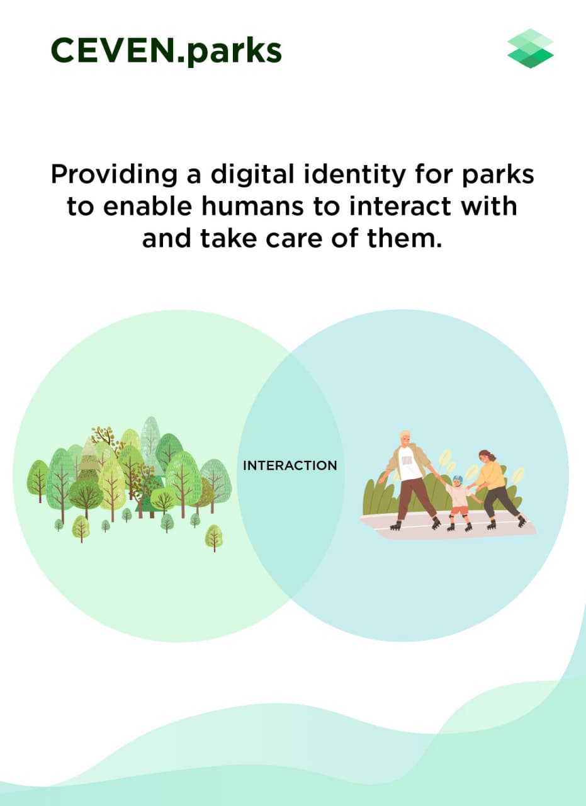
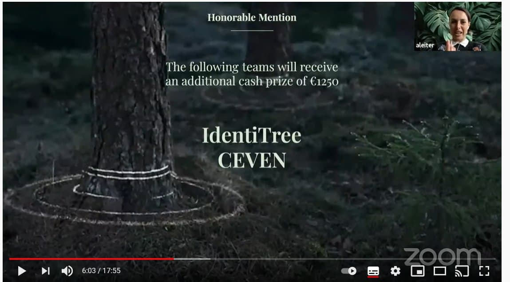

# Ceven.Parks Smart Contracts
Smart contracts for Ceven.Parks

## About

## Features
* Each user is identified by unique username(12 characters as per eosio naming convention).
* For the Hackathon, the account creation is not done for each user, just they are asked to give an non-existing username. In future, each account will be signing with their private key(securely stored via encryption/encoding with the platform).
* All the ACTIONs requires contract's permission, so the user doesn't have to worry about signing with private keys.
* Features:
  - User can signup & then login which is handled by blockchain [here](https://jungle3.bloks.io/account/cevenparksio?loadContract=true&tab=Tables&table=profile&account=cevenparksio&scope=cevenparksio&limit=100). Here, user have to provide 3 fields:
    + username (12 chars, 1-5a-z)
    + email id
    + password. NOTE: on the blockchain password_hash is stored, not the original password.
  - User can donate in any EOSIO tokens on that chain (where deployed like EOS, Telos, WAX). All the fund money can be withdrawn via multi-signature (all the keys have cumulative key weightage to active key). View [here](https://jungle3.bloks.io/account/cevenparksio?loadContract=true&tab=Tables&table=fund&account=cevenparksio&scope=cevenparksio&limit=100)
  - User can scan QR code (contains park id) & enter/exit into a park. All the parkuser status (check-in/out) corresponding to a park_id is maintained on blockchain. View [here](https://jungle3.bloks.io/account/cevenparksio?loadContract=true&tab=Tables&table=userentry&account=cevenparksio&scope=17000000001625384306&limit=100)
  - All the park data is uploaded onto the Blockchain. View [here](https://jungle3.bloks.io/account/cevenparksio?loadContract=true&tab=Tables&table=parkinfo&account=cevenparksio&scope=17000000001625384306&limit=100). Later on, it will be shifted to Decentralized Cloud.

## Workflow
1. [Sign up](./img/workflow_0.jpg)
1. [Login](./img/workflow_1.jpg)
1. Check-in
1. View parks data
1. Check-out
1. Logout

## Contracts
* [cevenparksio](./cevenparksio)

## Awards
